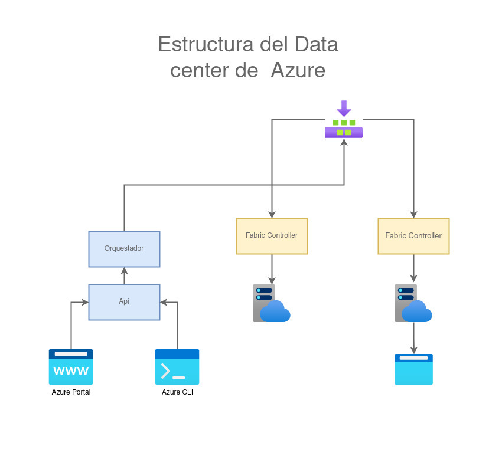
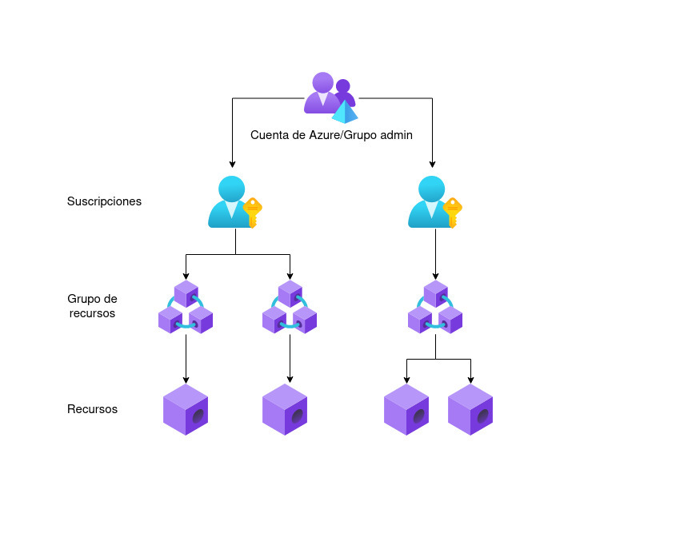

## 1.6 Arquitectura de Azure

### 1.6.1 Azure funciona con virtualización

Recibidas y organizadas por medio de un hypervisor.

### 1.6.2 Estructura del Data center

Internamente Azure recibe instrucciones de su portal y el CLI, los cuales
interaccionan con una API, el API con un orquestador que los lleva a un fabric
controller para generar una respuesta

Externamente Azure cuenta con:

* Portal
* Marketplace

El marketplace de Azure está disponible via Portal o usando su sitio web
*azuremarketplace.microsoft.com*

### 1.6.3 Cuentas de Azure

Una cuenta de Azure puede tener múltiples subscripciones, una suscripcion puede
tener múltiples grupos de recursos y un grupo de recursos puede tener múltiples
recursos.

Una suscripción de Azure es una unidad lógica de servicios de Azure que está
vinculada a una cuenta de Azure. Una suscripción de Azure es un objeto que
representa un contenedor en el que se pueden colocar recursos. Las suscripciones
están vinculadas a los inquilinos, por lo que un inquilino puede tener muchas
suscripciones, pero no viceversa.

* Recursos: Instancias de los servicios disponibles, tales como máquinas
    virtuales, disco duro, FaaS, base de datos. **Los recursos solo pueden
    pertenecer a un grupo de recursos**, pero pueden comunicarse con los otros.
* Grupo de recurso: Contenedor lógico donde se implementan los recursos de
    Azure: Aplicaciones web. Los grupos de recursos no pueden anidarse.
* Suscripción: Agrupación de cuentas de usuario y recursos creados por otras
    cuentas, con límites o cuotas definidas. Heredan las condiciones de su grupo
    de suscripción.
* Grupo de administración: Administran el acceso, la ordenación jerarquica de
    los recursos en colecciones, las directivas y cumplimientos de las
    suscripciones. 

### 1.6.4 Suscripciones grupos de administración

Se necesita de una suscripción de Azure para utilizar servicios, existen
cuentas:

* Desarrollador
* Prueba
* Suscripción
* Estudiante

#### 1.6.4.1 Limites de suscripción

* Facturación mensual
* Control de acceso a recursos

#### 1.6.4.2 Situaciones donde se necesitan otras suscripciones

##### 1.6.4.2.1 Entornos

Ideal para separar entornos de trabajo.

##### 1.6.4.2.2 Estructura organizacional

Para apegarnos a la estructura de la empresa.

##### 1.6.4.2.3 Facturación

Para manejar los costos de producción, desarrollo y pruebas por separado.

##### 1.6.4.2.4 Límites por suscripción

Para evitar las limitaciones de hardware que pueden ocurrir como parte de las
limitaciones por suscripción.

### 1.6.5 Grupos de administración

Podemos limitar los diferentes accesos para cada grupo o rol diferente de
suscripciones. Las suscripciones se organizan en contenedores llamados grupos de
administración y las condiciones de gobernanza se aplican a los grupos de
administración.

#### 1.6.5.1 Limitaciones de los grupos de administración

* Se admiten 10 000 grupos de administración en un único directorio.
* Un árbol de grupo de administración puede admitir hasta seis niveles de
    profundidad. Este límite no incluye el nivel raíz ni el nivel de
    suscripción.
* Cada grupo de administración y suscripción solo puede admitir un elemento
    primario.
* Cada grupo de administración puede tener muchos elementos secundarios.
* Todas las suscripciones y grupos de administración están dentro de una única
    jerarquía en cada directorio.

### 1.6.6 Recursos y grupos de recursos

#### 1.6.6.1 Características de los recursos

Un recurso es un elemento gestionable en Azure.

* Todos los **recursos deben pertenecer a un único grupo**.
* No puede haber recursos no asignados sin un grupo.
* No se pueden anidar.
* Son móviles entre grupos.

### 1.6.7 Azure resource manager

Nos permite automatizar la creación de recursos comunicándonos a través de Azure
Portal, Azure PowerShell, Azure CLI o un cliente REST por medio de plantillas.

Azure Resource Manager, permite administrar los recursos por grupos, RBAC (Role
Based Access Control), etiquetas y facturación.

Puedes agrupar los recursos por tags o políticas para replicar los tags en un
mismo tipo de recursos.

### 1.6.8 Características de los grupos de recursos

Un grupo de recursos es un contenedor de recursos.

* Si se elimina un grupo de recursos se borran todos los recursos del grupo.
* Utiliza permiso de control basado en roles (RBAC)
* Se organizan generalmente por:
    -   tipo
    -   tiempo de vida
    -   departamento
    -   facturación
    -   ubicación
    -   una combinación de los anteriores

### 1.6.9 Regiones

Un area geográfica en el planeta con uno o más datacenters conectados con una
latencia menor a 2ms.

* Algunos servicios solo están disponibles en ciertas regiones
* Algunos servicios son globales
* Hay más de 50 regiones
* Existen regiones especiales de gobierno (US DoD Central, US Gov Virginia, Gov
  Iowa)
* Existen regiones en asociacion (Este de China y Norte de China)

#### 1.6.9.1 Zonas de disponibilidad

Zonas donde existen al menos tres datacenters en una sola región, equipados con
sistemas de energía de emergencia, refrigeración y redes independientes, lo que
permite redundancia de servicios y datos ante errores.

No todas las regiones son compatibles con zonas de disponibilidad, usualmente
implica un costo extra.

Zonas de Azure

* Zona 1: Centro de Australia, Oeste de EE. UU., Este de EE. UU., Oeste de
    Canadá, Oeste de Europa, Centro de Francia y otras
* Zona 2: Este de Australia, Japón Occidental, Centro de la India, Sur de
    Corea del Sur y otras
* Zona 3: Sur de Brasil, Norte de Sudáfrica, Oeste de Sudáfrica, Centro de
    Emiratos Árabes Unidos, Norte de Emiratos Árabes Unidos
* Zona 1 de Alemania: Centro de Alemania y Nordeste de Alemania

#### 1.6.9.2 Pares de regiones

Azure siempre cuenta con al menos dos regiones con un máximo de 500 km de
distancia entre ambas, para la replicación de recursos en caso de
interrupciones. Se llevan acabo actualizaciones planeadas entre los pares. Los
pares son estáticos y no pueden ser elegidos.

