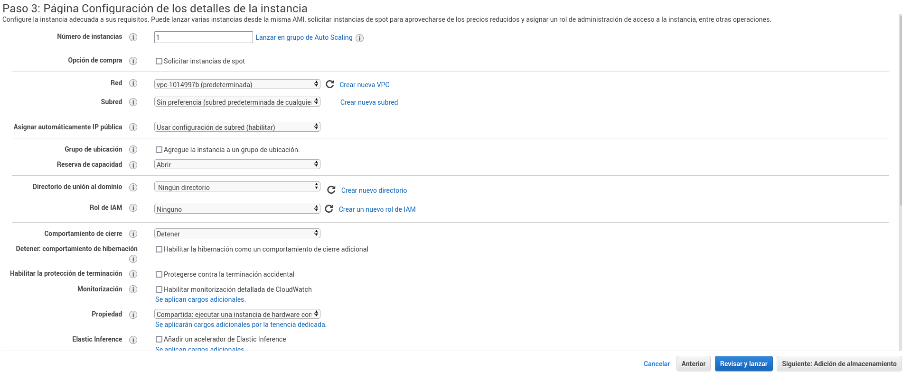
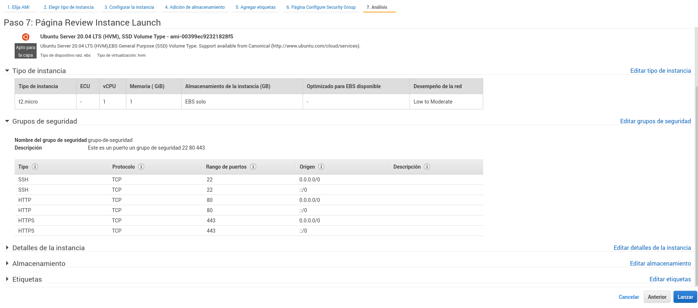
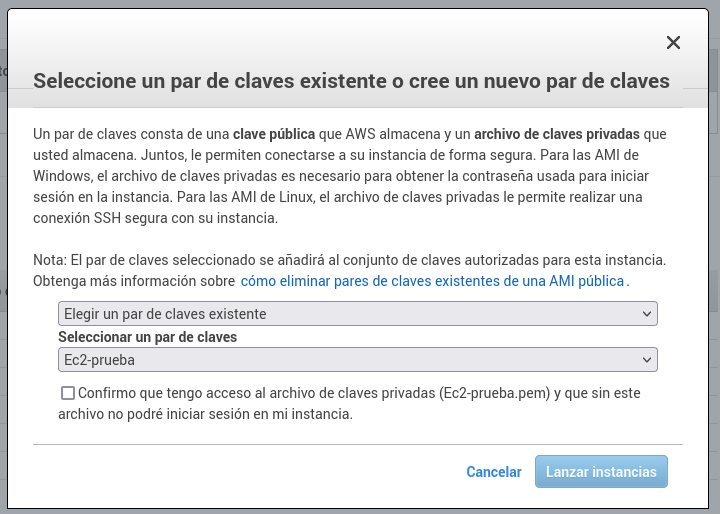

## 1.1 AMI

Máquinas virtuales llamadas instancias. Cuentan con imágenes
pre-configuradas, llamadas AMIs.

### 1.1.1 Ephemeral Storage

Almacenamiento que existe a menos que apaguemos o destruyamos la
instancia..

### 1.1.2 Elastic Block Storage

Este permanece a pesar que borremos la maquina virtual, podemos hacer
copias, restaurar o ir guardando en caso que este evolucionando algún
proyecto o alguna configuración de las maquinas.

### 1.1.3 Tipos de instancias EC2

Asegurate de tener la versión correcta de tus instancias o no se ver
ánada.

Las imágenes de Amazon vienen actualizadas con los últimos Drivers

La sección T2/T3 Unlimited en la configuración de la instancia nos sirve
si necesitamos mucha CPU o red, al habilitarla, Amazon nos lo dará sin
límite. El problema es que tiende a ser más costoso. Al parecer está
desactualizado, T2/T3 ya no aparece.

Es recomendable elegir un tagname adecuado para poder saber que hace la
instancia únicamente con verla.

El acceso a la máquina se hacáe por medio de una key. Es recomendable
guardarla en un lugar seguro o sera imposible conectarse por medio de
SSH

### 1.1.4 Proceso de creación de una instancia EC2

Elegimos la imagen principal

Hay diferentes capacidades entre las que podemos elegir

Podemos configurar número de instancias, ubicación y otras
características

Elegimos el tamaño

Es recomendable usar etiquetas para recordar fácilmente las instancias

Un grupo de seguridad nos indica los puertos que estarán abiertos, es
bastante similar a usar UFW. En este ejemplo dejamos los puertos básicos
para acceder por SSH y servir contenido por HTTP y HTTPS

Antes de lanzar la instancia AWS nos presentará un resumen de nuestra
configuración

Podemos elegir un par de llaves para conectarnos por SSH

La instancia demorará un poco en lanzarse pero AWS nos avisará cuando
esté disponible

### 1.1.5 Conectarse a la instancia por medio de SSH

Primero debemos quitarle permisos al archivo llave que se descargó

chmod 400 nuestra-llave.pem

Y ahora procedemos a conectarnos por medio de ssh

ssh -i \<path_del_archivo.pem\> ubuntu@\<dirección_IP_de_la_instancia\>

