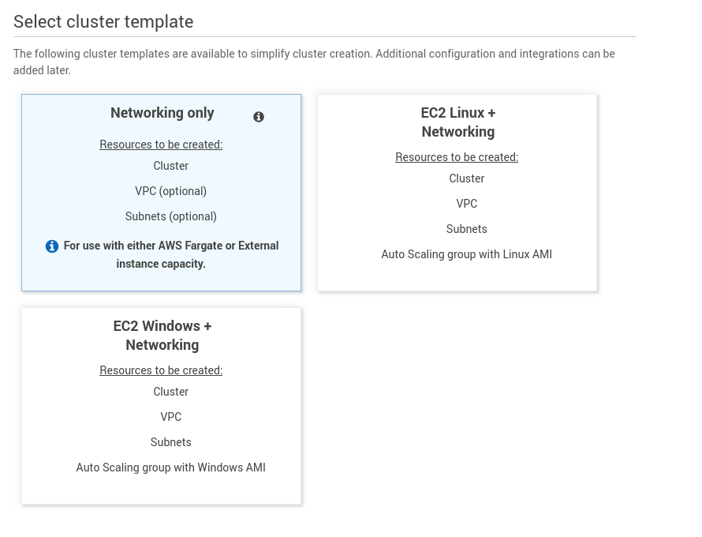
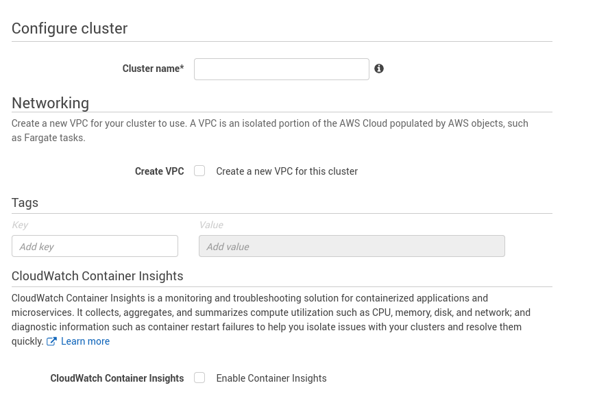
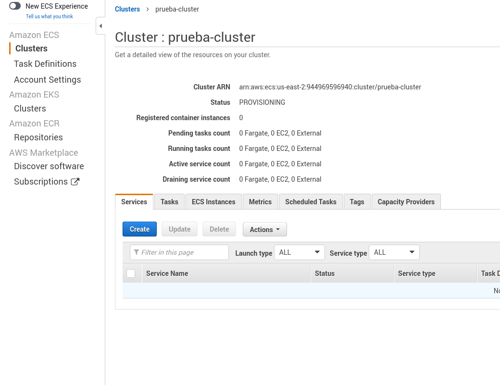
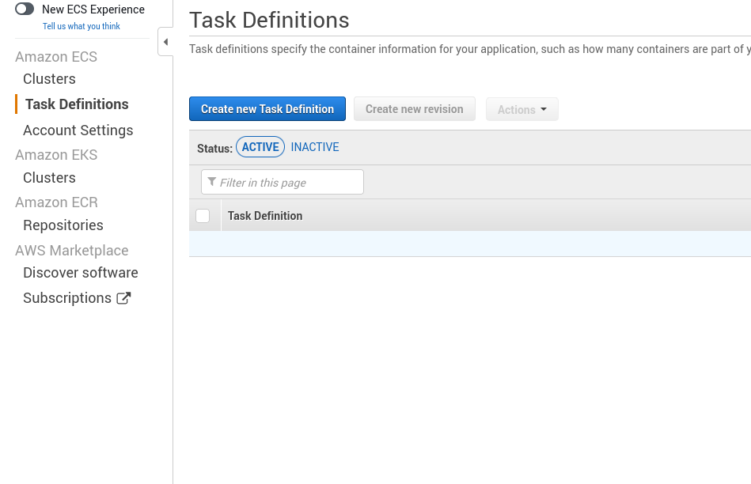
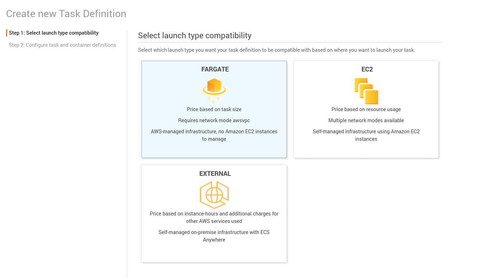
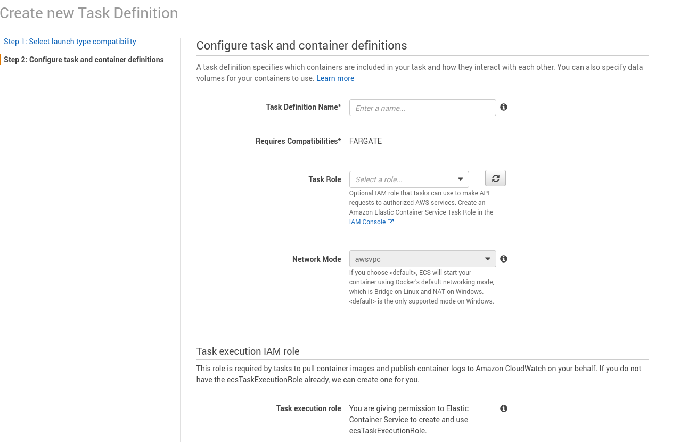
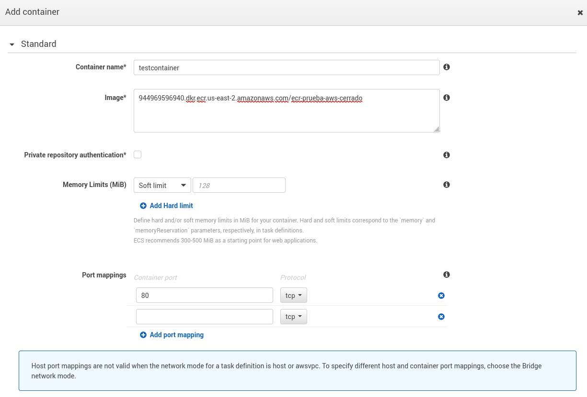
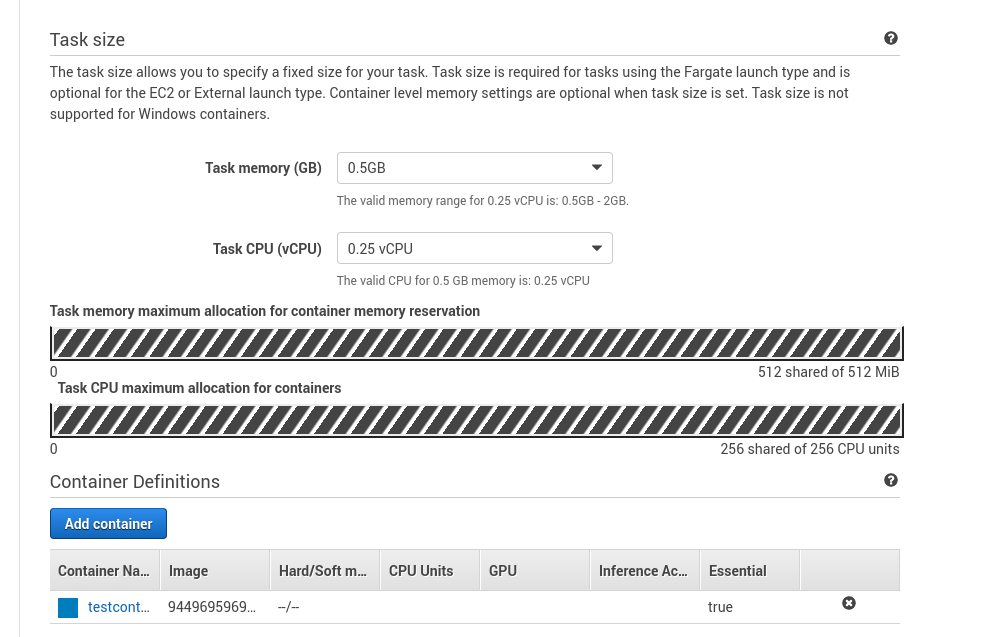
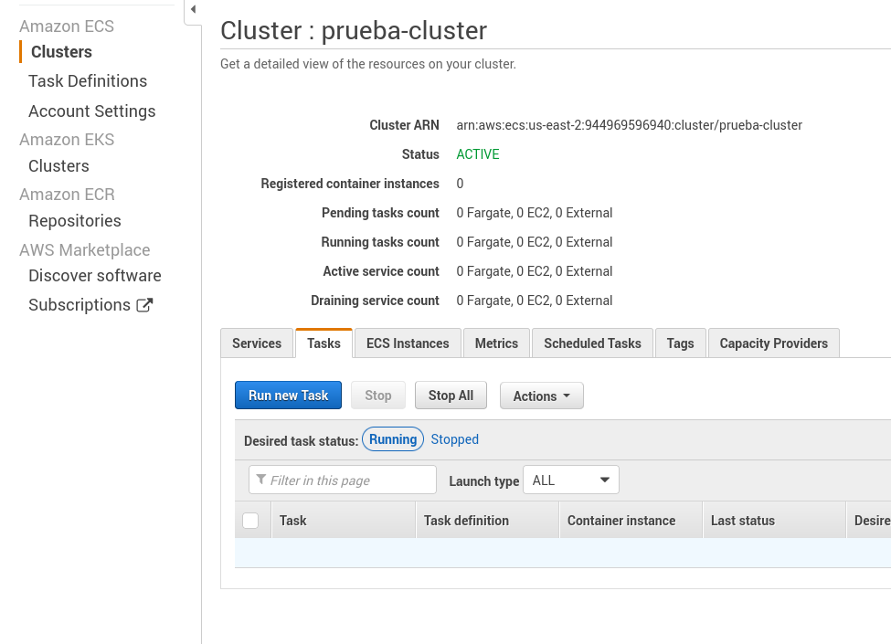
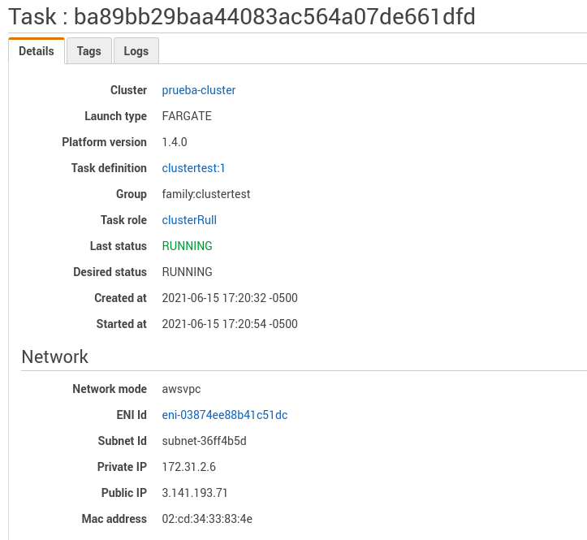

## 1.10 Creación de un cluster y tareas

Primero debemos elegir el tipo de Cluster

Le asignamos un nombre y tags si las necesitamos

Una vez creado procederemos a definiar la tarea que queremos ejecutar

Creamos un task definition

Seleccionamos el tipo de task, en este caso Fargate

Colocamos el nombre y debemos asegurarnos de tener un rol con los
permisos **Elastic Container Service Task**, el cual podemos elegirlo si
le damos click al enlace a la consola IAM

A continuación daremos click en el botón para definir el contenedor.
Pegamos el enlace a la imagen en ECR que queremos usar. Y abrimos el
puerto 80 para que esté disponible en el navegador.

Elegimos las capacidades de nuestro contenedor

Y al terminar esperemos hasta que esté activo para crear nuestra nueva
tarea

Usaremos Fargate y el VPC, subnet y grupos de seguridad predeterminados

Si examinamos el task, podremos apreciar la IP pública, la cual podremos
usar para acceder desde cualquier navegador.

