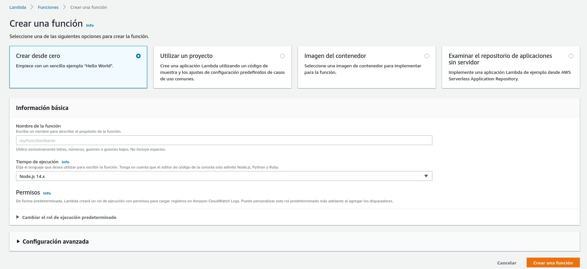
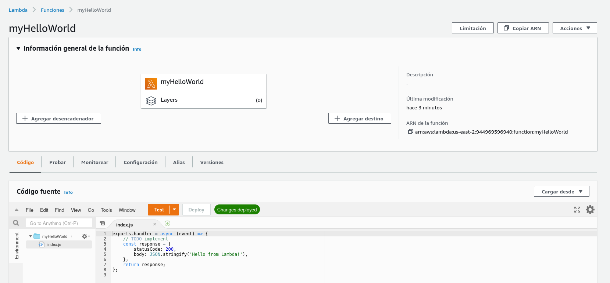
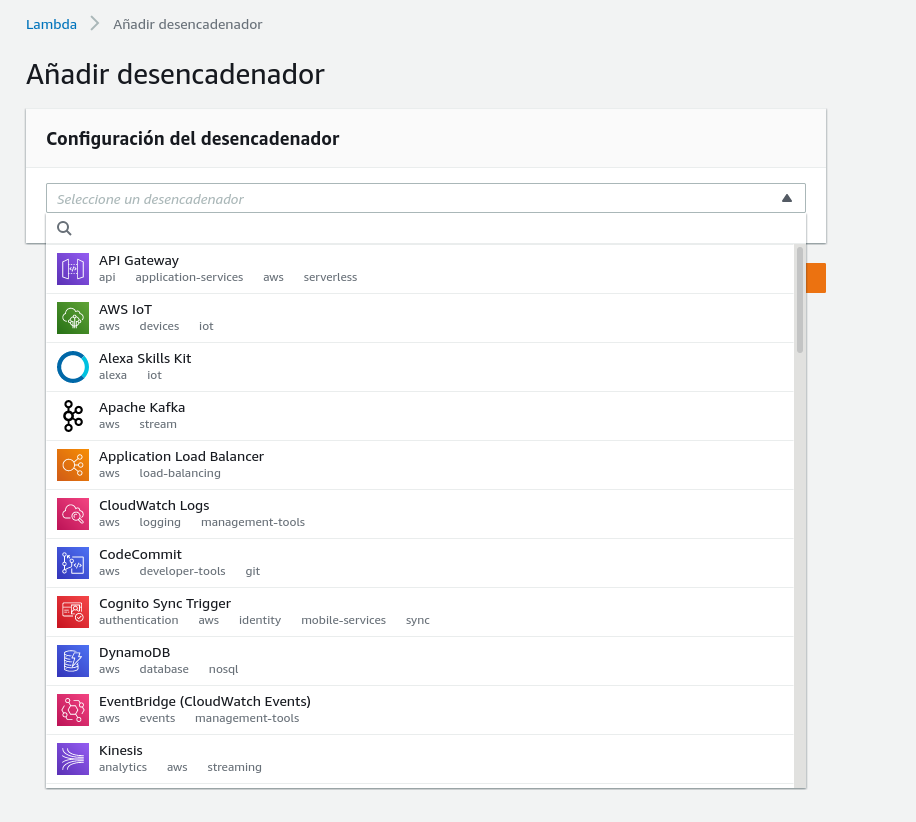
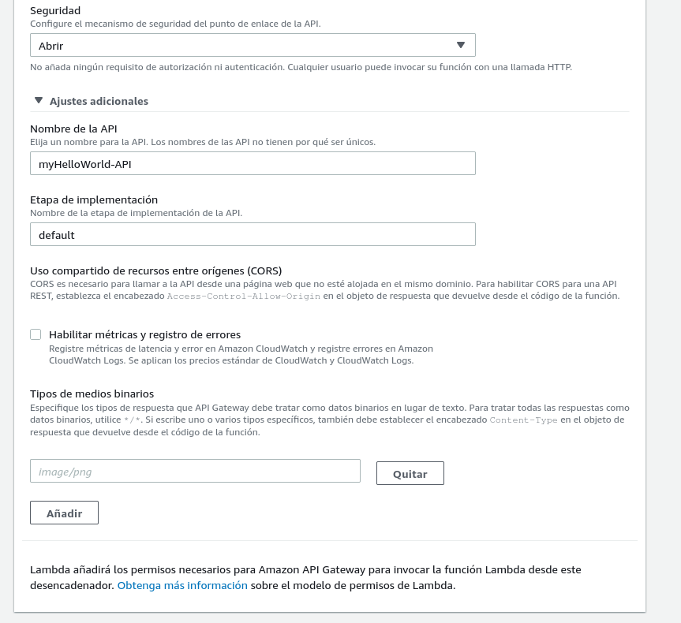
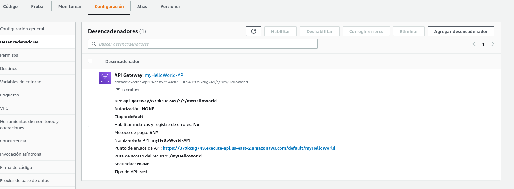

## 1.11 Lambda

Lambda es un producto que implementa la filosofía de Serverless, lo cual
significa no tener un servidor sino tener funciones que hagan cosas muy
específicas. Es código que puede conectarse a una base de datos,
servicios web, etc.

AWS soporta Node.js, Python, Java, C#, Go

Lambda escala automáticamente

A la fecha te permite un millón de llamadas gratis por mes.

### 1.11.1 Configuración

Cada función requiere una serie de permisos. Es recomendable usar el
principio de responsabilidad mínima.

La entrada de un Lambda es un API Gateway.

Podemos crear una lambda function a partir de diferentes opciones.
elegimos el lenguaje que querramos y podemos usar un rol que hayamos
creado o dejar que AWS cree uno con los permisos mínimos

Especificamos el contenido de la lambda functión y podemos asignarle un
trigger para que se ejecute dada una acción. Esta acción puede ser el
acceso a un endpoint

También peude ser cualquier otra cosa

Al crearla podremos asignarle diferentes opciones, dejarla a público o
que requiera acceso.

Podemos examinar el evento para ver el endpoint en caso de que cuente
con uno.

