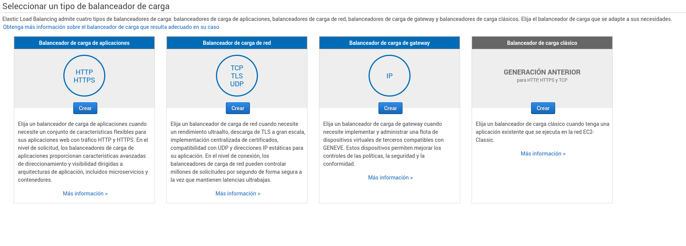
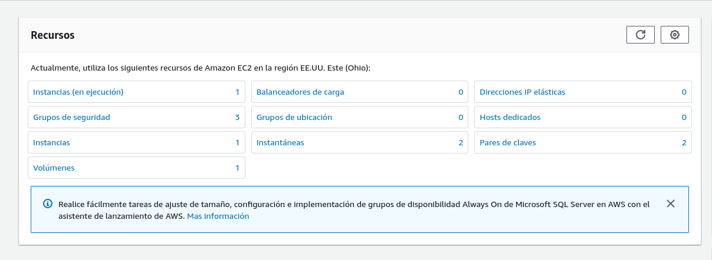
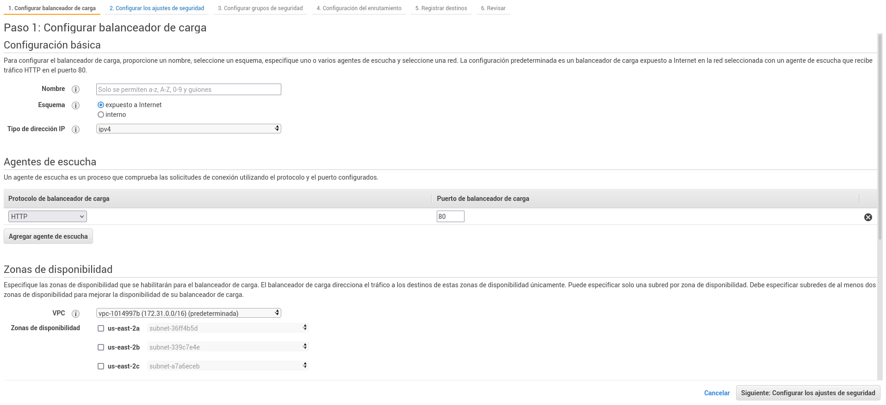
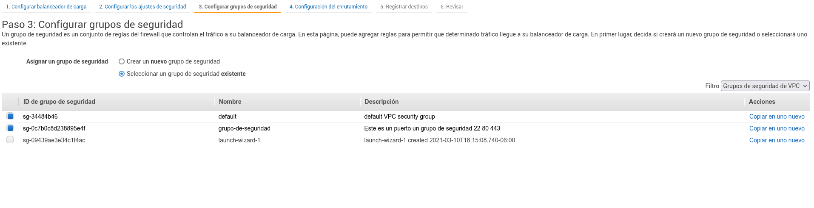
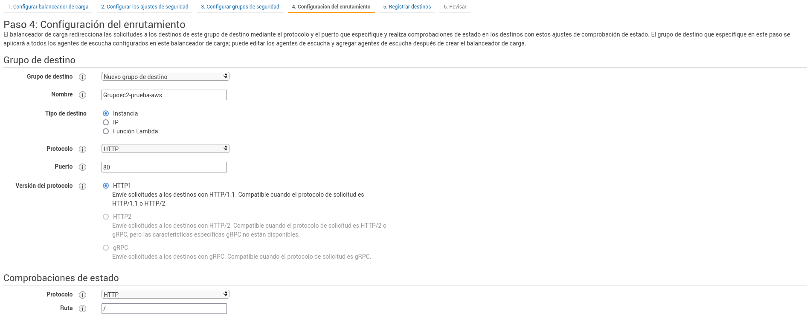
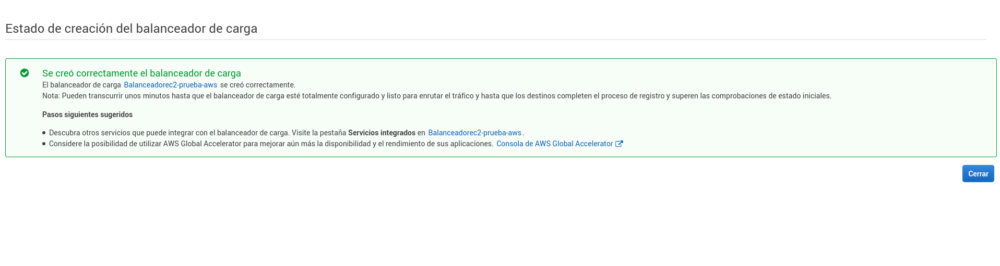
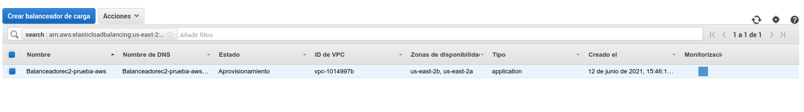
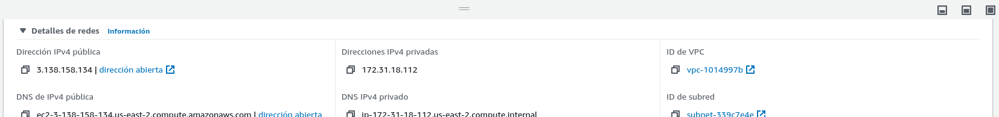

## 1.5 Balanceadores de carga

Usando un balanceador de carga podemos balancear peticiones HTTP, HTTPS
o TCP con los servicios de AWS.

Cuando creamos un load balancer, podemos ver en sus configuraciones
básicas un DNS el cual podemos usar en Route 53 como CNAME para ponerme
un nombre de dominio o subdominio.

Accedemos a la opción de balanceadores de carga en el menú principal

A continuación deberemos elegir un tipo de balanceador de carga.
Usaremos HTTP, HTTPS para el ejemplo

Especificamos sí será interno o expuesto a internet

Podemos configurar los grupos de seguridad o elegir uno ya existente.

Elegimos el grupo de destino

Si todo salió bien AWS nos mostrará un mensaje de confirmación

El balanceador de carga aparecerá en la opción de balanceadores de carga
y podremos ver su dirección DNS a la que podemos acceder

Si entramos en el enlace del balanceador podremos ver más detalles como
su IP pública y privada.

