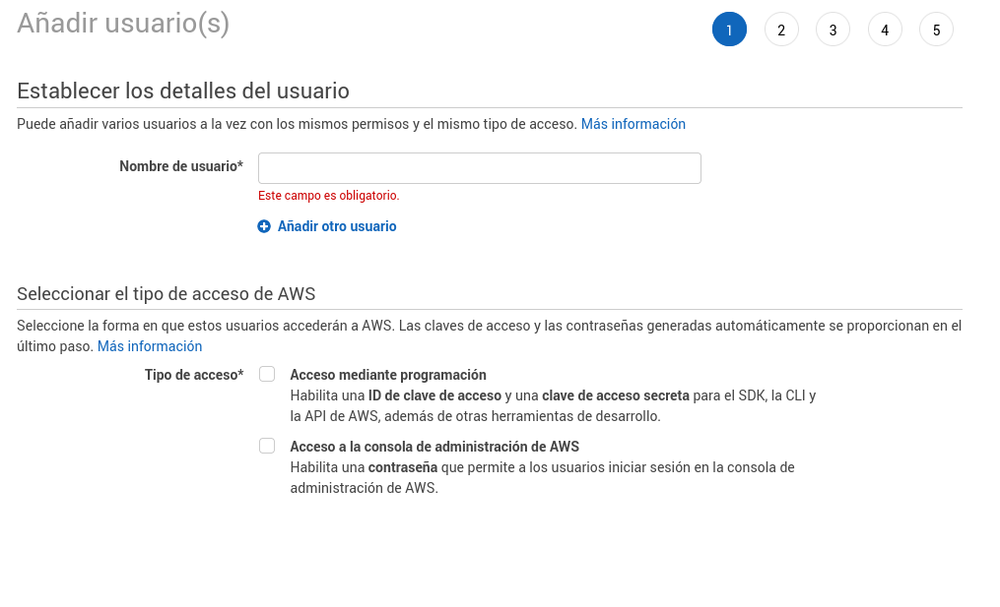
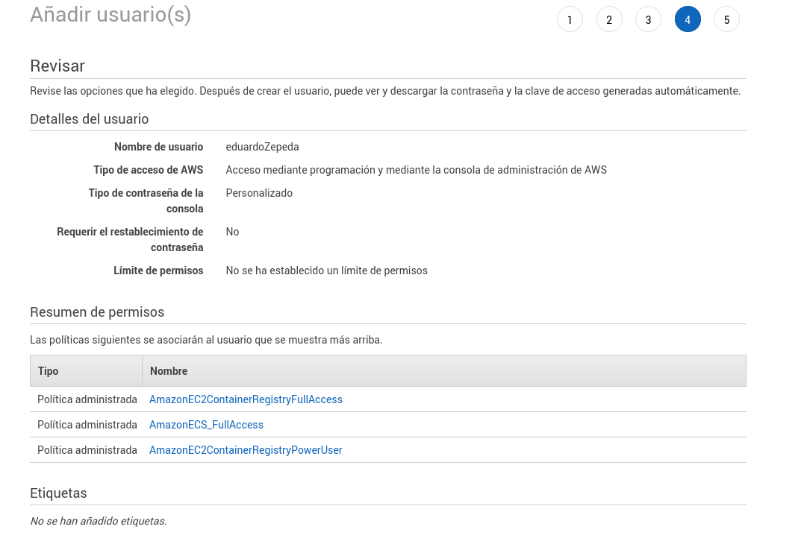
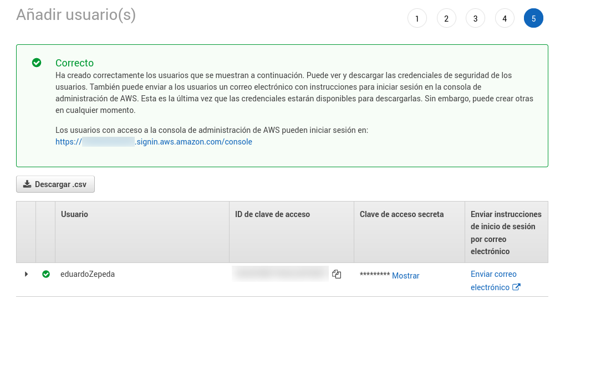
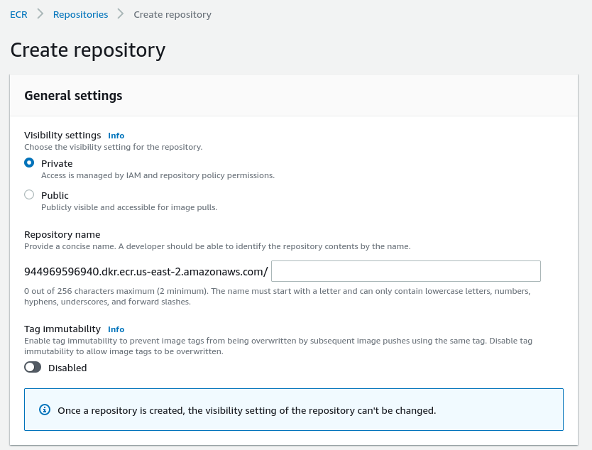

## 1.8 ECR/ECS/EKS

ECR es el servicio que te permite usar los contenedores a través de
Dockerfiles en Amazon.

Primero necesitamos entrar a ECS, solo ahí podremos acceder a ECR.

Es requisito instalar AWS CLI y Docker, así como otras dependencias como
pip, python-pip y otras.

### 1.8.1 Creación de una imagen en ECR

Para crear la imagen necesitaremos un usuario con los siguientes
permisos


Procederemos a añadir al usuario


Elegimos un nombre de usuario



Podemos crear un grupo de permisos o asociar los permisos directamente


Nos permitirá revisar el usuario antes de agregarlo



Posteriormente nos creará una ID y una clave de acceso que serán
necesarios para configurar el awscli



### 1.8.2 Instalación de AWS

Înstalamos AWS por medio de pip

``` bash
pip install awscli
```

A continuación correremos el comando

``` bash
aws configure
```

El cual nos pedirá nuestra ID, clave de acceso y la región para
configurar las credenciales que usaremos para acceder

### 1.8.3 Instalación de Docker

La instalación de Docker depende de cada distribución, por lo que es
mejor revisar la documentación oficial.

### 1.8.4 Creación del repositorio ECR

A continuación creamos un repositorio privado con el nombre que
querramos.



Una vez creado, podremos seleccionarlo y hacer click en el botón de
"view push commands" para obtener los pasos a ejecutar para mandar
nuestra imagen


### 1.8.5 ECS

ECS es toda la infraestructura que te permite correr contenedores de
Docker directo en AWS.

Amazon se encarga de todo, nosotros solo elegimos las capacidades.

Solo se paga por la capacidad que se solicita

Escalamiento basado en un contenedor de manera manual.

#### 1.8.5.1 Configuración de Docker

Usaremos sla siguiente secuencia de comandos

``` bash
sudo su
apt-get update
snap install docker -y
apt-get install git -y
```

Ahora podemos ejecutar un git clone a nuestro proyecto con Docker y
posteriormente correr

``` bash
docker build
```

Con esto, ya podrás hacer imágenes de contenedores y siguiendo las
instrucciones de la clase, podrás enviarlo a ECR (El registro de
contenedores de AWS).

### 1.8.6 EKS

EKS es una implementación de Kubernetes en Amazon que no requiere la
coordinación de nodos primarios y secundarios

Crea un ambiente de workers de k8s en AWS. Corre con el dashboard de
Kubernetes o cualquier otro orquestador

EKS va desde poner el nodo maestro de Kubernetes, poner los workers para
posteriormente conectarse a la API y ejecutar las tareas.

