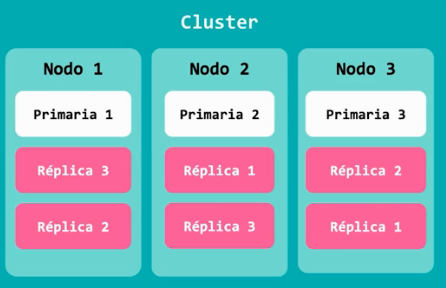

## 1.2 Configuración a nivel físico

Es un cluster agrupa nodos, mientras que los nodos agrupan los shards,
las piezas; las distintas divisiones de un índice, operan por si solas.
La primera contiene la información, las réplicas es un backup en caso de
que falle la primaria. Asegurándose que cada nodo tenga la información
del resto respaldada para poder restaurar la información completamente.

