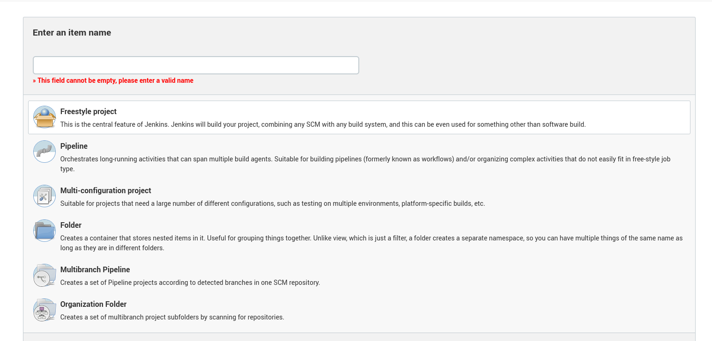
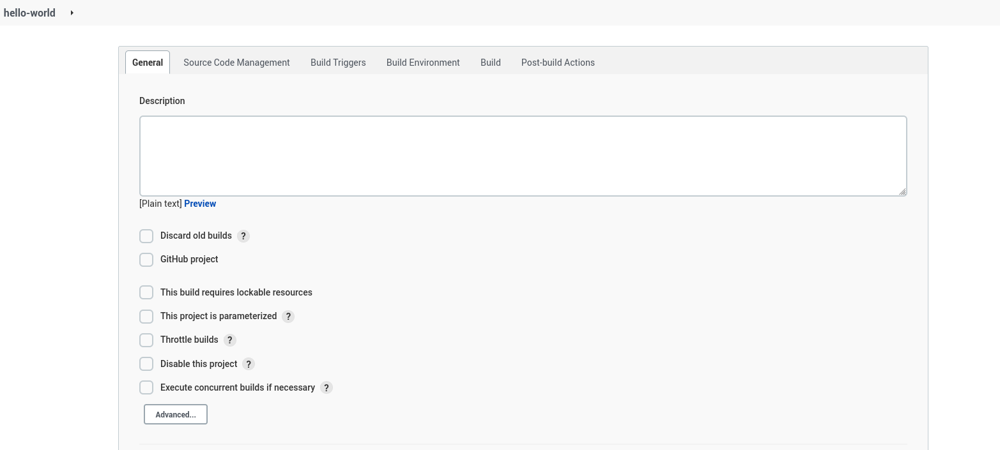
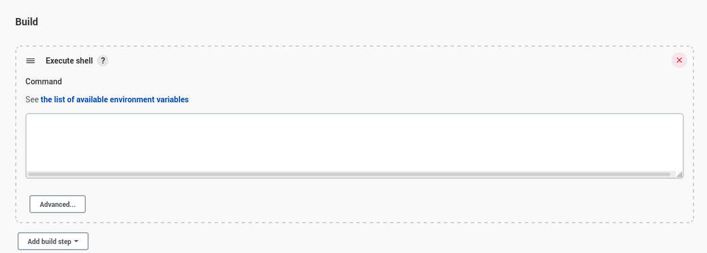
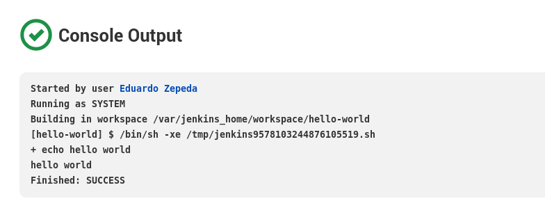

## 1.3 Jobs

Los jobs son la piedra central de Jenkins. Se ejecutan de manera
concurrente por el Build Executor. Pueden existir jobs de diferentes
tipos:

-   Freestyle project
-   Pipeline
-   Folder
-   Multi-configuration project

La siguiente es la pantalla de creación de un Job

Donde podremos especificar descripciones,

### 1.3.1 Freestyle project

Es el estilo más viejo y más versátil de Jenkins.

En la pestaña build environment podemos ejecutar comandos tal cual si
estuvieramos en la terminal de GNU/Linux.

Tip: Al ejecutar cada shell es necesario realizar nuevamente los cambios de
carpeta, pues se reinicia el working directory.

El job puede ejecutarse a mano dando un click en dando **build now**.

Si todo salió bien, podremos verificar el output

