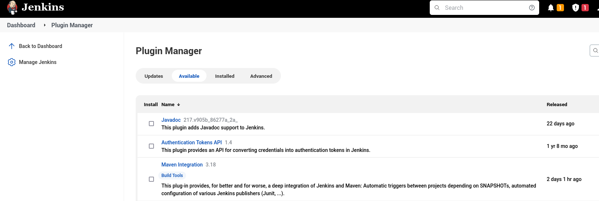

## 1.6 Plugins de jenkins

Los plugins son unidades que extienden las funcionalidades de Jenkins.
Los plugins estarán disponibles dentro del plugin manager.

Cada instalación puede instalarse sin reiniciar o hacerlo tras un
reinicio. **Para no interrumpir los jobs podemos instalarlo y reiniciar
después**, una vez que usemos esta opción, jenkins no aceptará nuevos
jobs hasta que ocurra el reinicio.

Ahora los paquetes que instalemos estarán disponibles para usarse en las
areas pertinentes de Jenkins.

Los cambios en los paquetes se pueden realizar dentro de la sección
configureTools.

