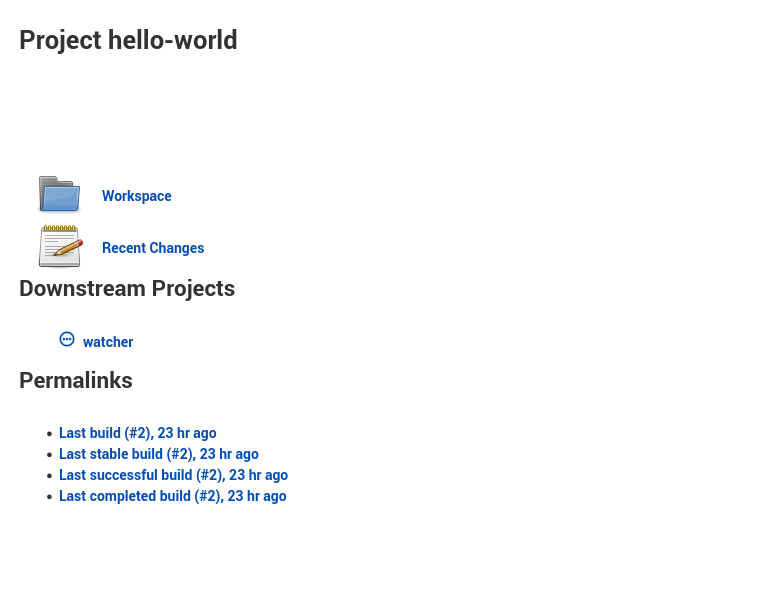
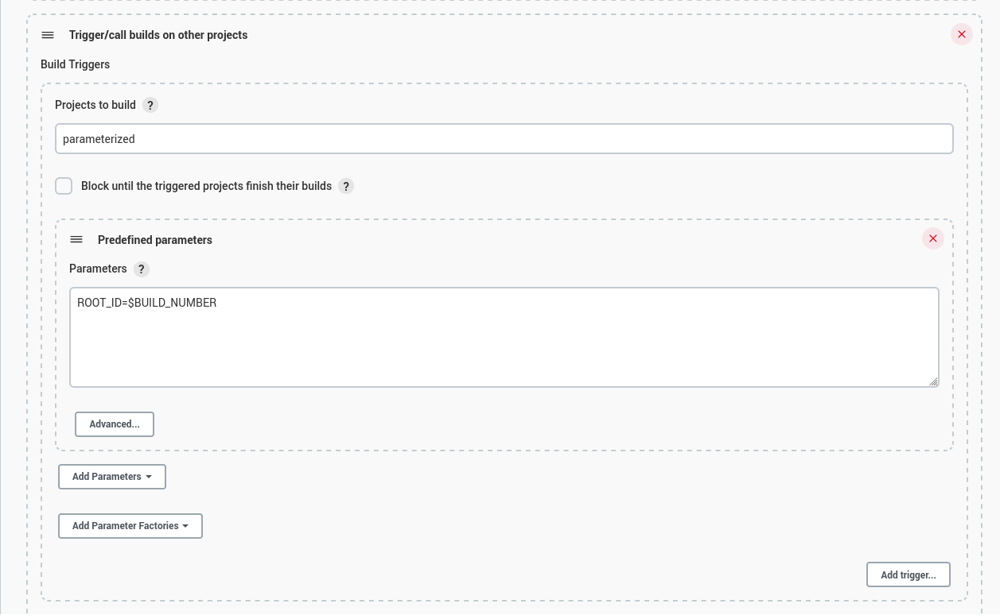
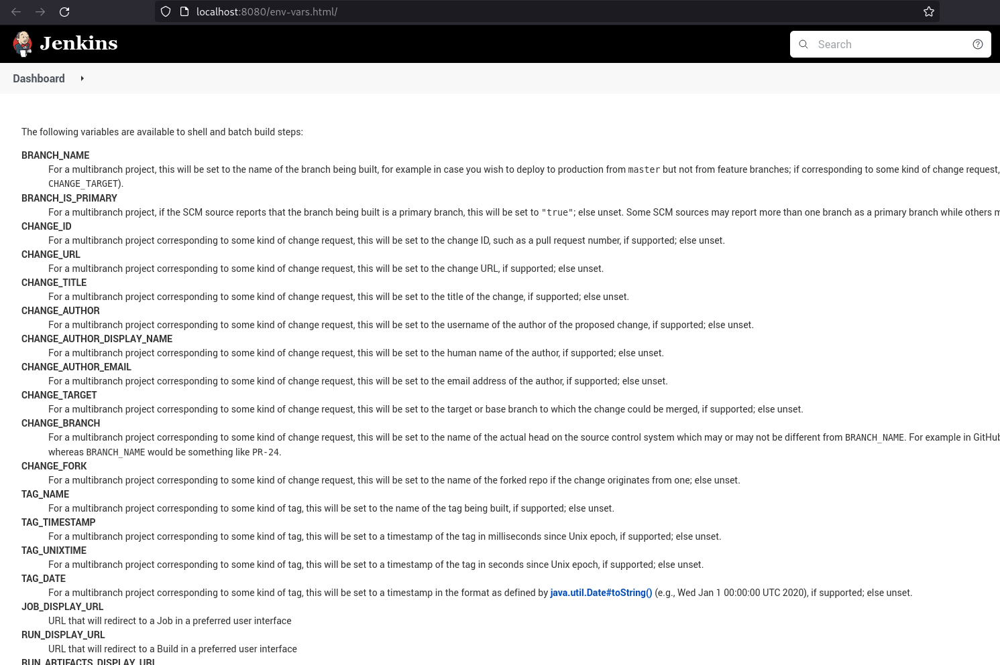
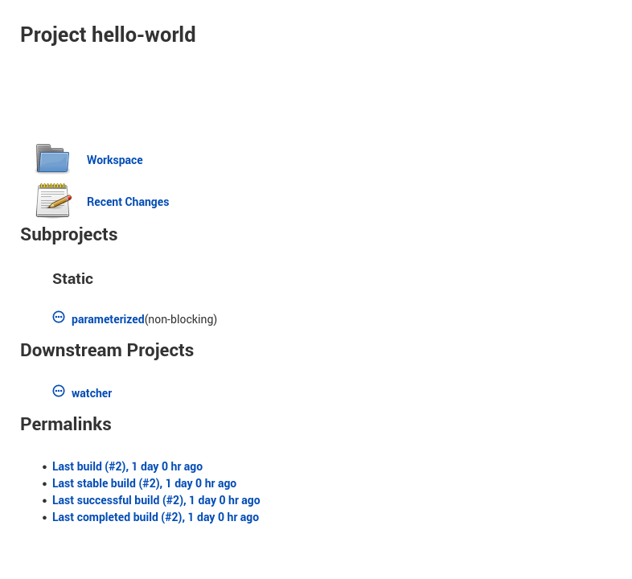

## 1.7 Cadena de jobs

Jenkins nos permite llamar jobs desde otros jobs, esto por medio de la
instalación de un plugin llamado "parameterized triggers", que habilita
la opción, dentro de job/\<name\>/configure, Trigger/call builds on
other projects, desde la configuración de un job.

Esto nos permite ejecutar un job cuando otro se crea y tendremos muchas
variables de entorno disponibles.

Al crear una dependencia de jobs se modificará la sección Downstream
projects

También podemos llamar el job con una variable de entorno.

Hay múltiples variables de entorno disponibles en Jenkins, se pueden ver
completas en [/env-vars.html](https://tuurl.com/env-vars.html/) Hay un
enlace en la sección de script de bash.

Estos jobs que se ejecutan al ejecutarse uno se añaden como jobs
non-blocking en la sección de Subprojects.

