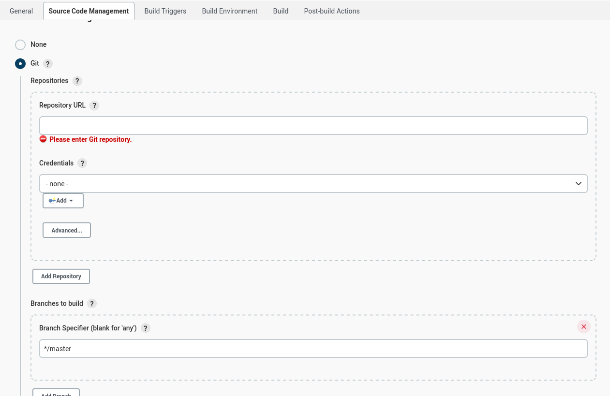
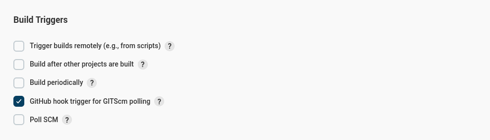
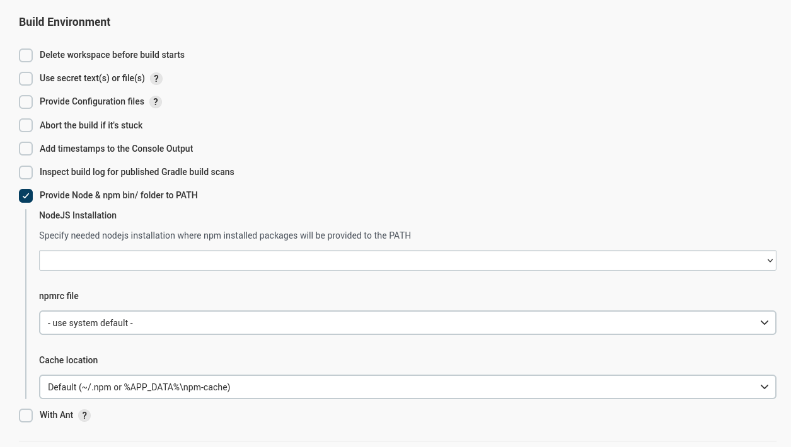
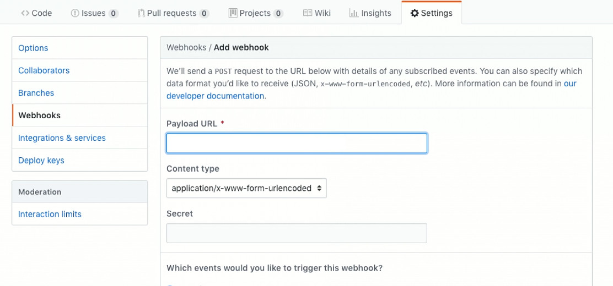

## 1.8 Conexión con github

Para conectarse con github necesitamos colocar la url del repositorio
dentro de la pestaña source Code Management.

Para ejecutar los tests en cualquier rama dejamos la sección "branches
to build" en blanco.

Y en los build triggers necesitamos usar Github hook trigger

Recuerda especificar la versión de Node u otros plugins en Build
Environment

### 1.8.1 Conectando Github con Jenkins

Dentro de la sección de configuración de nuestro repositorio de github,
podemos crear un webhook, que creará un petición a la url que le
indiquemos.

**Se necesita una slash al final de la url**

