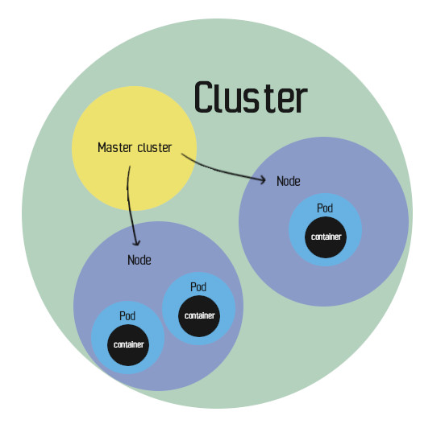

## 1.5 Arquitectura de kubernetes

Kubernetes consiste en:

-   Un nodo master llamado master o nodo maestro
-   Worker nodes: llamados minions o simplemente nodos

Generalmente solo se necesita interaccionar con el nodo master, este recibe
instrucciones de una API a la que se accede con una UI o un CLI.

### 1.5.1 Estructura del nodo master

El nodo master consiste en los siguientes elementos:

-   API Server: A lo que todo se conecta, los agentes, el CLI, el dashboard etc.
    Se usa el algoritmo de ruft para algoritmo de elección. Si el nodo master se
    cae perdemos el API server pero el resto de los nodos siguen funcionando.

Este primer elemento se comunicará con los otros tres:

-   Scheduler: Cuando es necesario crear un job, un pod en máquinas específicas,
    el scheduler se encarga de asignar los pods a los nodos, revisando siempre
    las restricciones y los recursos disponibles.
-   Controller Manager: Es un proceso que está en un ciclo de reconciliación
    constante buscando llegar al estado deseado con base al modelo declarativo
    con el que se le dan instrucciones a K8s. Lo realiza a través del control de
    los controllers, tales como:
    -   Replica manager
    -   Deployment manager
    -   Service manager
    -   Etcd: Key value store que permite que el cluster este altamente
        disponible.
-   etcd, es un key-value store que guarda la configuración del cluster de
    kubernetes.

### 1.5.2 Nodos

Anteriormente **se les conocia como minions**. Todos los nodos y masters están
conectados a una red física para poder comunicarse entre sí.

#### 1.5.2.1 Componentes muy importantes que viven en los nodos

-   Kubelet: Agente de kubernetes, se conecta con el control play y le pregunta
    que recursos (pods, contenedores) debo correr al scheduler via API Server.
    **Monitorea los pods constantemente** para saber si están activos, los
    recursos disponibles, etc. y se comunica constantemente con scheduler por
    medio del API Server.
-   Kube-proxy: Se encarga de balancear el tráfico que corre a través de
    nuestros contenedores/servicios. Una vez llega una request este se encarga
    de decidir a que pod y contenedor debe de ir.
-   Container-runtime: El contenedor local, que contiene las aplicaciones
    corriendo.

