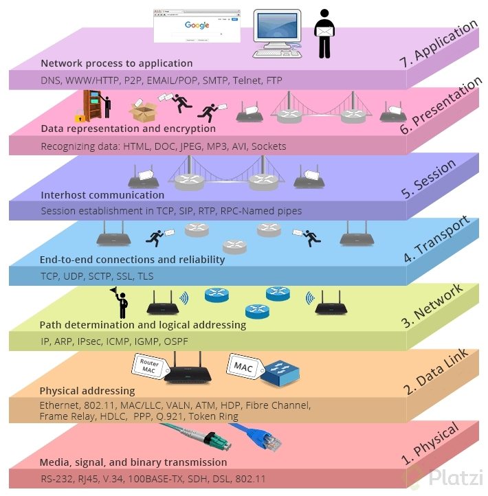

## 1.5 Arquitectura de kubernetes

Kubernetes consiste en:

-   Un nodo master llamado master o nodo maestro
-   Worker nodes: llamados minions o simplemente nodos

Generalmente solo se necesita interaccionar con el nodo master, este recibe
instrucciones de una API a la que se accede con una UI o un CLI.

### 1.5.1 Estructura del nodo master

El nodo master consiste en los siguientes elementos:

-   API Server: A lo que todo se conecta, los agentes, el CLI, el dashboard etc.
    Se usa el algoritmo de ruft para algoritmo de elección. Si el nodo master se
    cae perdemos el API server pero el resto de los nodos siguen funcionando.

Este primer elemento se comunicará con los otros tres:

-   Scheduler: Cuando es necesario crear un job, un pod en máquinas específicas,
    el scheduler se encarga de asignar los pods a los nodos, revisando siempre
    las restricciones y los recursos disponibles.
-   Controller Manager: Es un proceso que está en un ciclo de reconciliación
    constante buscando llegar al estado deseado con base al modelo declarativo
    con el que se le dan instrucciones a K8s. Lo realiza a través del control de
    los controllers, tales como:
    -   Replica manager
    -   Deployment manager
    -   Service manager
    -   Etcd: Key value store que permite que el cluster este altamente
        disponible.
-   etcd, es un key-value store que guarda la configuración del cluster de
    kubernetes.

### Kubernetes Networking

- Todo el cluster es una gran red del mismo segmento
- Todos los nodos deben conectarse entre si, sin NAT
- Todos los pods deben conectarse entre si, sin NAT
- kube-proxy es el componente para conectarnos a pods y contenedores (userland proxy / iptables)
- Los pods trabajan a capa 3 y los servicios a capa 4
- Concepto de CNI (container networking interface)

### El modelo de red es el modelo OSI

Capas del Modelo OSI.

* Aplicacion
* Presentacion
* Sesion
* Transporte
* Red
* Enlace de Datos
* Fisica

Una buena técnica mnemotécnica para memorizarlo es:

[A]ll [P]eople [S]eems [T]o [N]eed [D]ata [P]rotection

