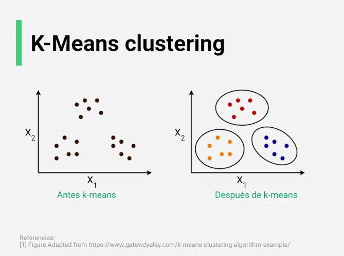
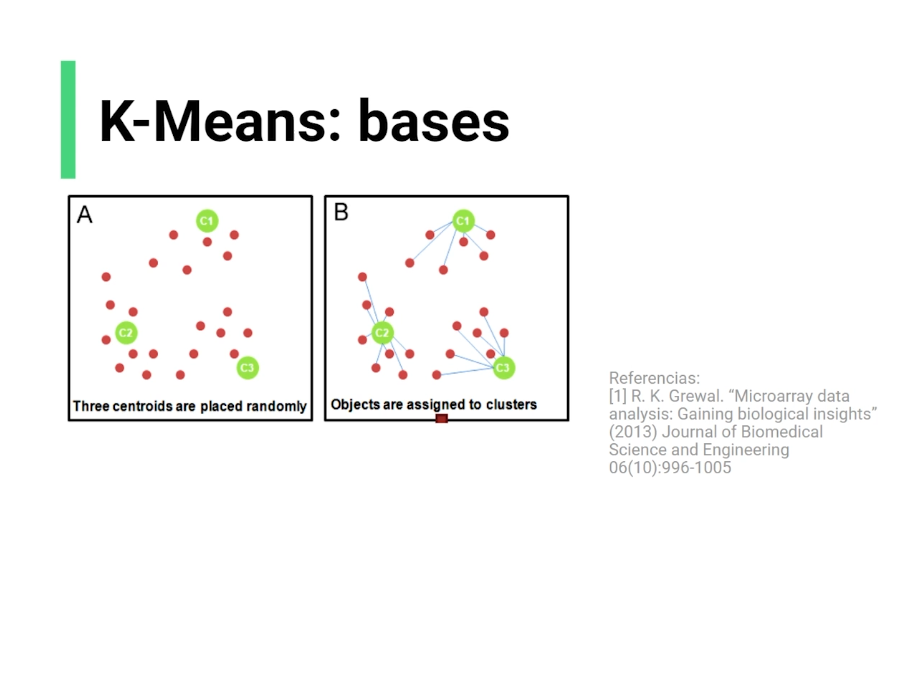
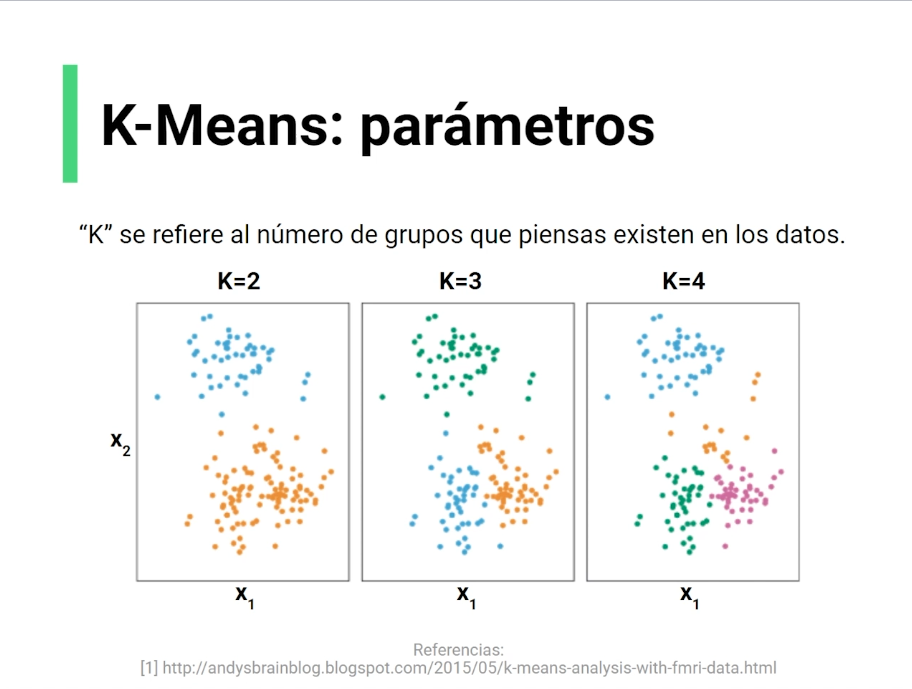
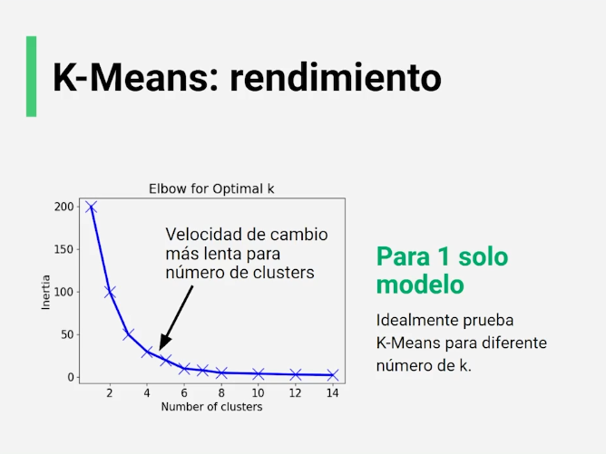

## Algoritmos de aprendizaje no supervisado

### K-means clustering

Implica la agrupación de una serie de datos, que busca encontrar la estructura mediante la asignación de puntos de datos a grupos específicos.

Estos grupos se llaman clusters.

Para hacer esto k-means usa centroides, que representan cada cluster y que, inicialmente, se colocan de manera aleatoria. El objetivo es actualizar la posición de los centroides encontrando la media de los puntos de datos que pertenecen a cada cluster.

El parámetro más importante es el número de clusters, conocido como "k", de ahí el nombre "K-means". Este valor cambia por completo el significado de todo, pues varios puntos de datos pueden moverse de un cluster a otro.

### Pasos de la regla de actualización

1. Colocar aleatoriamente los centroides
2. Calcular la distancia de cada punto de datos a cada centroide
3. Asignar cada punto de datos a un cluster basándonos en la distancia más corta
4. Computar nuevos centroides como promedios del os miembros del cluster.

### Calcular el rendimiento

Para evaluar un modelo usaremos una gráfica de elbow (codo), debido a su similaridad con un brazo flexionado. Y se evaluarán dos factores:

- Inercia: Que tan cerca están los puntos al centroide, se busca un número pequeño
- Silhouette score: Que tan lejanos son los clusters [-1,1]. De preferencia cercanos a 1

Lo ideal es encontrar la velocidad de cambio más lenta, el punto de inercia más pequeño antes de que se dispare el número de clusters, es decir, el punto de inflexión

### Función de coste

La función de coste se calcula:

$J(c¹, ..., c^k)=\sum^k_{j=1}\sum_{x∈Sj} ||x_1^j-c^j$||²

