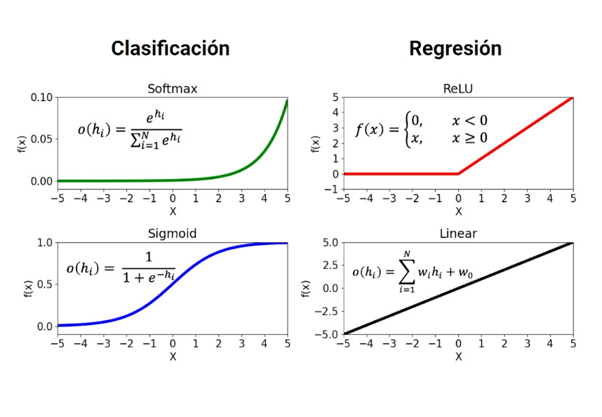

## Redes neuronales

Una red neuronal es un modelo que usa neuronas y conexiones entre ellos para hacer predicciones.

Son usadas usualmente para aprendizaje supervisado.

### Capa de entrada

Los pesos gobiernan la fuerza de una conexión. La unidad escondida (nodo) acepta una combinación lineal de nodos adjuntos previamente a él.

``` mermaid
Edad->h1
Salario->h1
Dinero->h1
```

$g_1(x)=w_{0,1}+w_{1,1}x_1+w_{2,1}x_2...$

### Capa de entrada conecta múltiples unidades

La unidad oculta ejecuta una funcion en la combinacion linea $(g,(x))$

Esta funcion es una funci6n de activacion.

#### Tipos

- Linear
- Softmax
- ReLU
- Sigmoide

Expresadas visualmente así



### Capa de salida

Nos da la predicción del valor