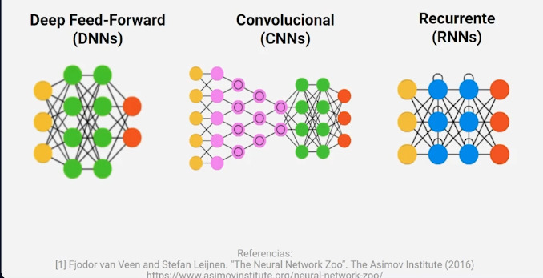
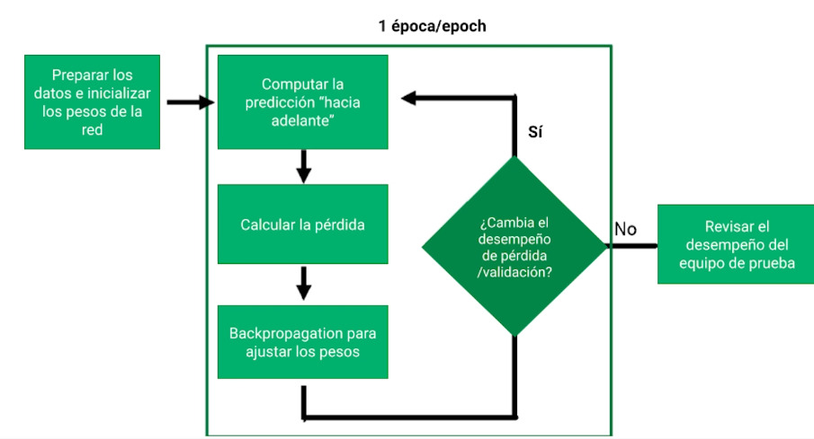

## Entrenar redes neuronales

El proceso se resume en 3 partes

1. Escoger arquitecture
2. La receta de entrenamiento
3. Ajustar la tasa de entrenamiento

### Tipos de redes neuronales

Las redes neuronales se dividen en estos 3 tipos:

- DNNS Deep Feed-Forward
- Convolucionales
- Recurrentes

#### DNNS

Usa funciones de activicación. Es usada en muchos problemas complejos

#### Convolucionales

Operador convolucional/pool y kernels

Usada en imágenes y genómicos

#### Recurrentes

Celdas de memoria/puerta

Representa secuencias

Ideal para su uso en lenguaje

### Receta de redes neuronales

El proceso se resume en la siguiente imagen

### Backpropagation

Es la regla de actualización para ajustar los pesos

Se actualizan tomando la derivada parcial, empezando desde la salida hacia atrás, hasta las entradas de datos.

- Si la tasa de aprendizaje es muy pequeña toma mucho tiempo encontrar buenos pesos
- Si es muy grande, el modelo podría "atorarse" en una meseta local.