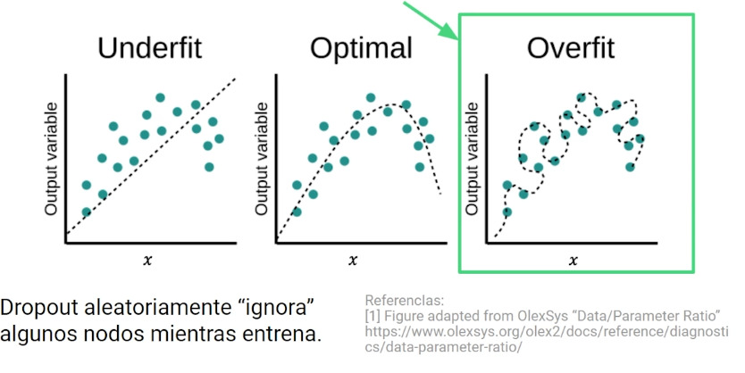
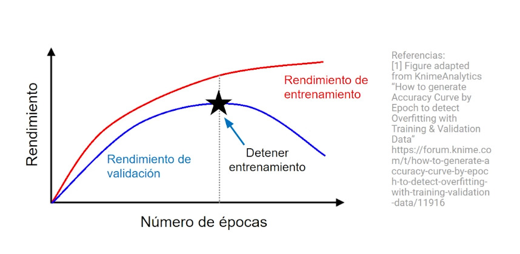

## Overfitting

El término se refiere a cuando el método ha memorizado la información de entrenamiento de los datos, pero no ha encontrado el patrón que los predice. El modelo funcionará perfectamente con los datos de entrada, pero fallará con datos nuevos.

### Prevenir overfitting

Una estrategia para prevenir el overfitting es detener el entrenamiento en su mejor punto de predicción.

