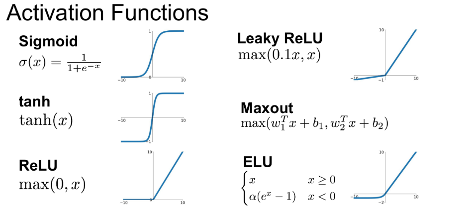

## Funciones de activación

En redes computacionales, la Función de Activación de un nodo define la salida de un nodo dada una entrada o un conjunto de entradas.

### Tipos de funciones de activación

- Escalonada (De 0 a 1)
- Signum (De -1 a 1)
- Sigmoide Función de 0 a 1 con valores continuos, ideal para probabilidad.
- Tangente (De -1 a 1) con valores negativos para "x"
- Relu, la más usada. (Valores menores a 0 son 0, si es mayor, deja el valor)
- Softmax, nos da la probabilidad de ciertos outputs

La página [wolframalpha](https://www.wolframalpha.com/) nos permite obtener las fórmulas de las funciones y su comportamiento.