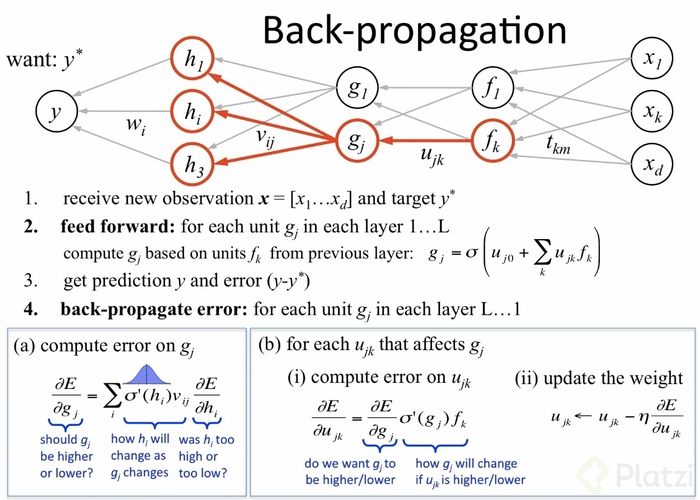

## Backpropagation

Backpropagation (propagación hacia atrás) es un algoritmo de entrenamiento utilizado en redes neuronales artificiales para ajustar los pesos de las conexiones entre las neuronas. Es una técnica de optimización que utiliza el descenso del gradiente para minimizar la función de error entre las salidas de la red y los valores objetivo.

La propagación hacia atrás se llama así porque el error se propaga a través de la red desde la capa de salida hasta la capa de entrada, de manera inversa al flujo de la información durante la fase de entrenamiento hacia adelante (feedforward). Durante el proceso de entrenamiento, se calcula el error de la salida de la red en función de los valores objetivo, y luego se propagan estos errores hacia atrás a través de la red para actualizar los pesos de las conexiones.

### Fundamentos matemáticos del backpropagation

La derivada del coste se calcula con la regla de la cadena.

$C(a(Z^L))$