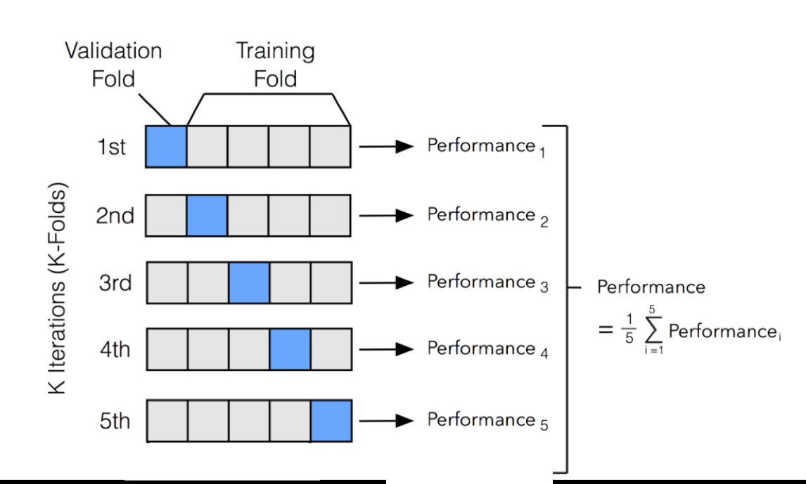

## K-fold validation

K-fold validation, también conocida como validación cruzada en k grupos, es una técnica utilizada en el aprendizaje automático (machine learning) para evaluar y validar modelos de manera más robusta y precisa.

### División de datos en k-fold validation

Cuando se entrena un modelo de aprendizaje automático, es común dividir los datos disponibles en dos conjuntos: uno para entrenamiento y otro para evaluar el rendimiento del modelo. Sin embargo, esta división puede ser problemática si los datos de prueba no son representativos de la distribución de los datos reales o si la partición es aleatoria y los resultados varían con cada partición.



La validación cruzada en k-fold aborda este problema dividiendo los datos en k grupos o pliegues (folds) de tamaño similar. El valor de k se selecciona de antemano y generalmente se elige un número entre 5 y 10. Luego, el modelo se entrena y evalúa k veces, cada vez utilizando un grupo diferente como conjunto de prueba y los restantes como conjunto de entrenamiento.

### Entrenamiento en k-fold validation

En cada iteración, el modelo se entrena en k-1 pliegues y se evalúa en el pliegue restante. Luego, se promedian los resultados de evaluación obtenidos en cada iteración para obtener una estimación general del rendimiento del modelo. Esto proporciona una evaluación más estable y confiable del modelo, ya que se utiliza todo el conjunto de datos para entrenamiento y evaluación en diferentes combinaciones.

### Usos de k-fold validation

La validación cruzada en k-fold es especialmente útil cuando el conjunto de datos es limitado, ya que aprovecha al máximo los datos disponibles sin requerir una partición adicional en conjuntos de entrenamiento y prueba. También ayuda a identificar problemas como el sobreajuste (overfitting) y el subajuste (underfitting) de manera más efectiva.


### Ejemplo de imeplentación de K-Fold

``` python
k = 4
num_val_samples = len(train_data) // 4
num_epoch = 80
all_history = []
```


``` python
for i in range(k):
    print("Fold " , i)
    val_data = train_data[i*num_val_samples: (i+1) * num_val_samples]
    val_targets = train_targets[i*num_val_samples: (i+1) * num_val_samples]
    
    partial_train_data = np.concatenate(
    [train_data[:i * num_val_samples],
     train_data[(i+1) * num_val_samples:]],
     axis= 0   
    )
    
    partial_train_targets = np.concatenate(
    [train_targets[:i * num_val_samples],
     train_targets[(i+1) * num_val_samples:]],
     axis= 0   
    )    
    model = build_model_regression(13)
    history = model.fit(partial_train_data, partial_train_targets, epochs=num_epoch, batch_size =16, 
                        validation_data = (val_data, val_targets),
                        verbose=0)
    all_history.append(history.history['val_mae'])
```