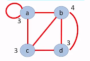
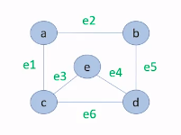

## 1.2 Teoría de grafos

El concepto básico de un gráfico es, un modelo matemático que sirve para
representar las relaciones entre objetos de un conjunto. Un gráfico o
grafo es un conjunto de vértices, o nodos, que están conectados a través
de aristas, líneas o conexiones.

Hay varios tipos de grafos, el primero de todos es el nodo simple donde
tenemos los nodos y las conexiones gracias a las cuales nos podemos
mover fácilmente a través del grafo.

-   El Multígrafo tiene varias conexiones entre dos nodos, permitiendo
    tener dos rutas distintas para estos nodos.
-   Un Pseudografo al igual que el multígrafo puede tener múltiples
    conexiones entre dos nodos y, además, una de estas conexiones puede
    partir y terminar en el mismo nodo.
-   El Grafo Ponderado cuenta con un valor dentro de las conexiones,
    esto puede verse como el costo, o recurso, de una ruta de nodos.
-   El Grafo Dirigido establece una dirección en las conexiones, esta
    dirección se representa con una flecha.
-   Multígrafo Dirigido que cuenta con dirección en las conexiones y
    puede haber múltiples conexiones entre dos nodos.

### 1.2.1 Grafos caminos y cadenas

¿Qué es el grado de un vértice? Es el número de aristas que tiene un
nodo con otros nodos.

Existe una propiedad matemática que nos dice que la sumatoria de todos
los grados de los vértices de un grafo es igual al doble de las aristas.
Otra propiedad nos indica que si tenemos más de dos vértices con grado
impar es imposible recorrer de una sola vez todo el grafo sin repetir un
camino. \* Una cadena es una sucesión de vértices y de conexiones entre
sí. \* Un camino a diferencia de una cadena es una sucesión de vértices
y conexiones donde no puedes repetir ningún vértice ni conexión, \* En
un ciclo el vértice de inicio es igual al vértice donde termina. \* Un
grafo conexo es aquel donde todos los nodos están unidos entre sí.

#### 1.2.1.1 Caminos y ciclos eulerianos

Ya sabes que un camino es una sucesión de vértices y conexiones donde no
pasas dos veces por el mismo vértice, y un ciclo es una sucesión de
vértices y conexiones donde el nodo de inicio es igual al nodo final.

Pues un Camino Euleriano es aquel camino que recorre todo el grafo sin
repetir una conexión, esto se cumplirá siempre y cuando **un grafo no
tenga más de dos vértices o conexiones con grado impar.**

Un Ciclo Euleriano es aquel ciclo que recorre todo el grafo sin repetir
una conexión, este se cumplirá solo cuando **todos los vértices o
conexiones del grafo son grado par.**

#### 1.2.1.2 Caminos y ciclos hamiltonianos

A diferencia de los caminos y ciclos eulerianos, los caminos y ciclos
hamiltonianos buscaran recorrer los nodos una sola vez sin importar el
camino que utilicemos.

Para afirmar que hay un camino hamiltoniano se debe cumplir la condición
donde la suma del grado de dos vértices seleccionados es mayor o igual
al número de vértices menos uno, de otra forma puede que exista el
camino hamiltoniano, pero **no se podrá afirmar.**

Si hay un camino hamiltoniano, pero no un ciclo, entonces el grafo no es
hamiltoniano.

### 1.2.2 Matriz de adyacencia

Cuando un grafo se vuelve muy complejo es recomendable usar una matriz
de adyacencia. En esta se estableceran las conexiones que tiene cada
nodo en forma de tabla.

La imagen anterior puede representarse por medio de la siguiente matriz.
Donde el grado es la sumatoria de todas las conexiones.

|     |     |     |     |     |       |
| --- | --- | --- | --- | --- | ----- |
|     | a   | b   | c   | d   | Grado |
| a   | 1   | 1   | 1   | 0   | 3     |
| b   | 1   | 0   | 1   | 2   | 4     |
| c   | 1   | 1   | 0   | 1   | 3     |
| d   | 0   | 2   | 1   | 0   | 3     |

Si la matriz **no es simétrica** entonces podremos hablar de un grafo
dirigido

En la matriz de adyacencia asimétrica, si sumamos las filas de cada nodo
nos dirá la cantidad de conexiones que inciden en el nodo, y si miramos
las columna nos dirá sobre que nodo inciden los nodos.

### 1.2.3 Matriz de incidencia

Antes de construir una matriz de incidencia deberás darle un nombre o
identificador a cada conexión de tu grafo. Estas conexiones van a
representar las columnas de tu matriz y los nodos van a representar las
filas.

Colocaremos un 1 en las celdas donde una conexión incida en un nodo, si
no incide en el nodo entonces colocaremos un 0.

En la siguiente matriz e1 incide sobre a y sobre c, e2 incide sobre a y
b...

En esta matriz solo habrá 1 y 0, a diferencia de la anterior.

|     |     |     |     |     |     |     |
| --- | --- | --- | --- | --- | --- | --- |
|     | e1  | e2  | e3  | de4 | e5  | e6  |
| a   | 1   | 1   | 0   | 0   | 0   | 0   |
| b   | 0   | 1   | 0   | 0   | 1   | 1   |
| c   | 1   | 0   | 1   | 0   | 0   | 1   |
| d   | 0   | 0   | 0   | 1   | 1   | 1   |
| e   | 0   | 0   | 1   | 1   | 0   | 0   |

