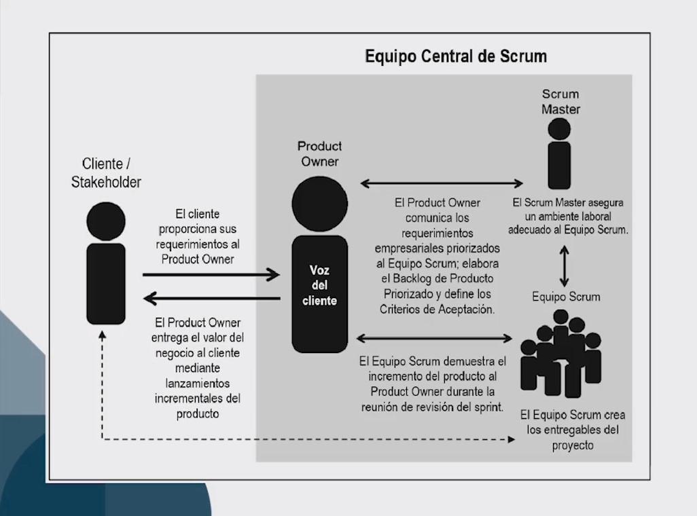

## 1.4 Aspectos

Abordados y administrados a lo largo de un proyecto

### 1.4.1 La organización y los diferente roles de SCRUM

Los aspectos son los siguientes:

-   Organización: Los roles centrales son:  
    -   Product Owner: Representa la voz del cliente y responsable de
        lograr máximo valor
    -   SCRUM máster; Se asegura que el equipo de SCRUM cuente con un
        medio ambiente adecuado
    -   SCRUM Team: Deben entender requerimientos del Produc Owner.

-   Roles no centrales:  
    -   Stakeholders
    -   Guía de SCRUM (SBOK ó PMO)
    -   Proveedores

-   Justificación del negocio

-   Calidad: Es la capacidad del producto o los entregables para cumplir
    con los criterios de aceptación y de alcanzar el valor de negocio
    que el cliente espera. Revisar la calidad requiere de retrospectiva,
    verificación constante, feedback

-   Cambio: El cambio se acepta y se minimiza.

-   Riesgo: Un evento incierto o serie de eventos que pueden afectar los
    objetivos de un proyecto y pueden contribuir a su fracaso. Hay que
    identificarlos, evaluarlos, priorizarlos, mitigarlos y comunicarlos.

