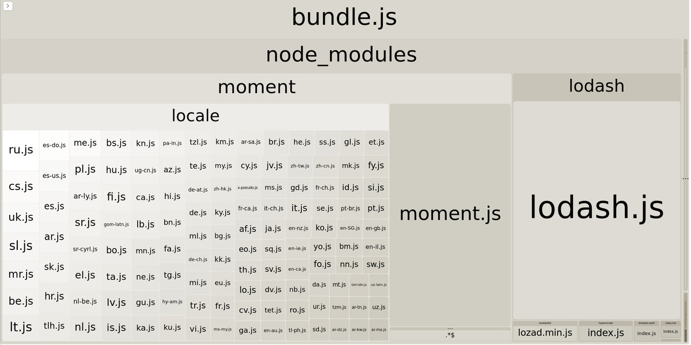

## 1.16 Javascript

Es importante usar el modo producción en webpack para que este tome las
medidas necesarias para optimizar el bundle.js

### 1.16.1 Webpack Bundle analyzer

Puede usarse para analizar el código y decirnos exactamente como está
coconformado nuestro bundle. Si lo incluimos en los plugins, al correr
una compilación en producción nos abrirá una ventana en el navegador con
la información. Podemos personalizar su uso de la siguiente manera.

``` bash
npm install webpack-bundle-analyzer
```

``` javascript
const BundleAnalyzerPlugin = require('webpack-bundle-analyzer').BundleAnalyzerPlugin

const plugins: []

const shouldAnalyze = process.argv.includes('--analyze')

if (shouldAnalyze) {
  plugins.push(new BundleAnalyzerPlugin())
}

const config = {
  ...
  plugins,
}
```

Esto nos permitirá identificar las partes críticas que necesitamos
reducir. **Hay que reemplazar aquellas librerías de las que solo usamos
una o dos funciones por otras más pequeñas**. Es muy común agregar
librerías completas para solo usar una o dos funciones.



### 1.16.2 Uso de Bundlephobia

[Bundlephobia](https://bundlephobia.com/) nos da muestra el costo de
añadir un nuevo paquete de npm

