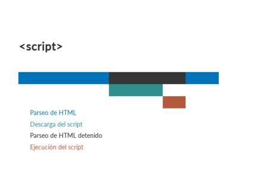
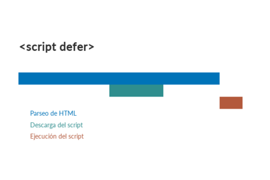
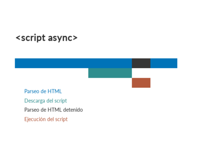

## 1.5 Recursos bloqueantes

Javascript y CSS son recursos que bloquean el renderizado del HTML en el
navegador. Podemos modificar este comportamiento con los atributos defer
y async.



### 1.5.1 Critical CSS

Permite extraer el CSS necesario para renderizar la sección más visible
de una ventana (Above the Fold).

### 1.5.2 defer

El atributo defer le dice al navegador que descargue un archivo pero no
lo ejecute.

``` html
<script defer src="ruta-del-script/script.js">
```



### 1.5.3 Async

El atributo async descarga el script en paralelo, pero en cuanto se
acaba de descargar lo ejecuta, bloqueando el parsing.



``` html
<script async src="ruta-del-script/script.js">
```

